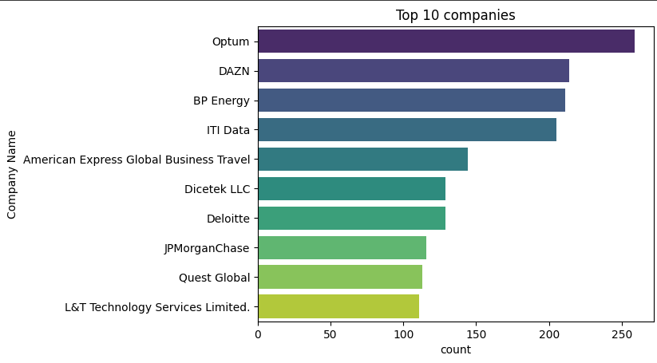
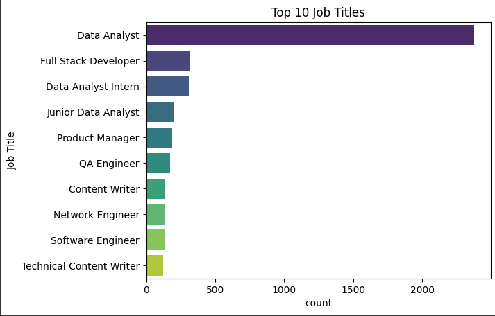
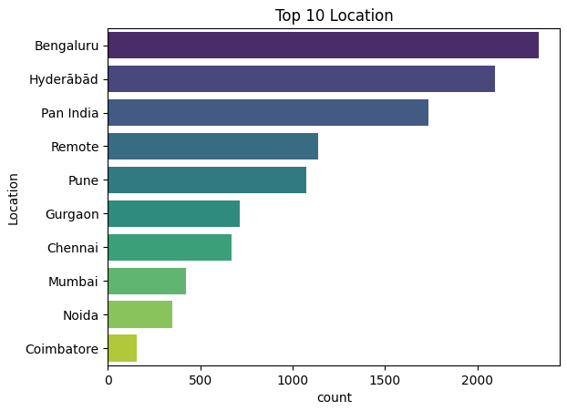
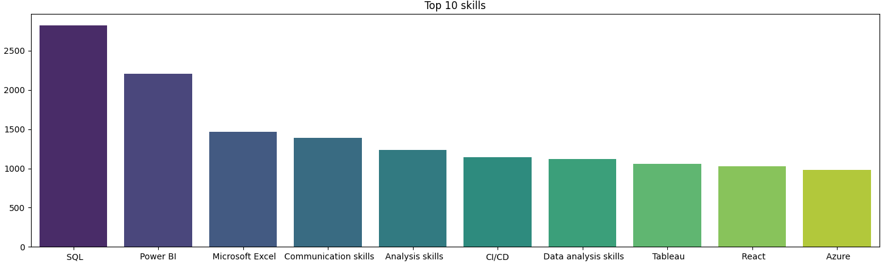
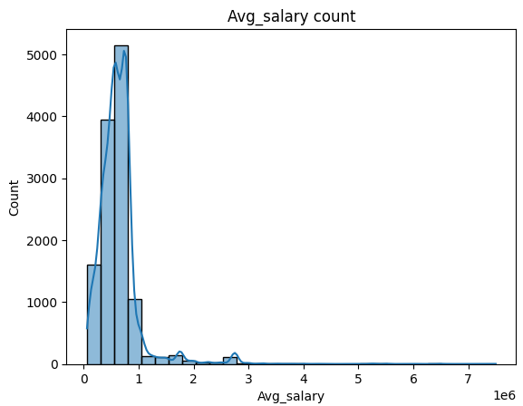
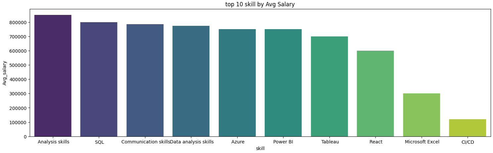
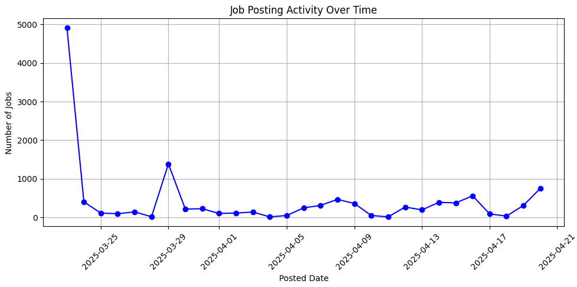
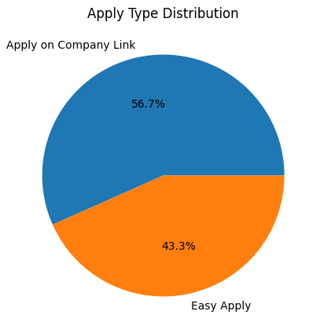
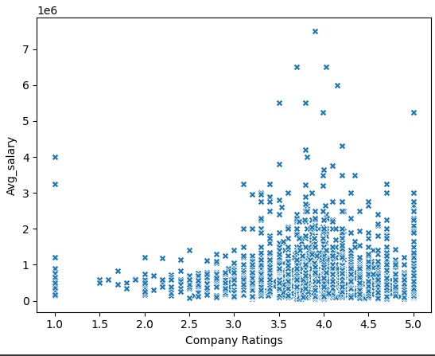

# 📊 Exploratory Data Analysis of Glassdoor Job Postings

> Insights for Students and Educational Institutions  
> Presented by: **Uppu Palakonda Raju**

## 📝 Overview

This project performs an **Exploratory Data Analysis (EDA)** on **12,000+ job postings** from Glassdoor to provide actionable insights for:

- 🎓 Students exploring career paths  
- 🏫 Educational institutions enhancing industry alignment  
- 💼 Stakeholders tracking job market trends  

---

## 📁 Dataset Summary

- **Scraped via**: Octoparse  
- **Initial Records**: 14,000+  
- **Final Cleaned Dataset**: 12,000  

---

## 🔍 Key Insights & Visualizations

### 🏢 Top Hiring Companies
- Companies like **Optum**, **DAZN**, and **BP Energy** lead in job volume.

---

### 🧑‍💼 Most Common Job Titles
- **Data Analyst** is the most frequent, followed by **Full Stack Developer** and **Intern roles**.

---

### 📍 Leading Job Locations
- **Bengaluru** and **Hyderabad** dominate the Indian tech hiring scene.

---

### 🛠️ Most Demanded Skills
- **SQL**, **Power BI**, and **Excel** top the list of must-have skills.

---

### 💰 Salary Distribution
- Majority of salaries range between **₹50K–₹10LPA**

---

### 🧠 Skills with Highest Average Salary
- Skills like **Analysis**, **SQL**, and **Communication** command higher pay.

---

### 📈 Job Posting Trends
- Observe how job postings fluctuate over time.

---

### 🧾 Apply Type Distribution
- **56.7%** apply via **company links**, and **43.3%** use **Easy Apply**.

---

### ⭐ Company Ratings vs Salary
- Better-rated companies generally offer higher pay.

---

## 🎯 Conclusion

This EDA project provides a holistic overview of job market trends. It helps:

- Students optimize job search and skill development  
- Institutions align programs with industry needs  
- Both parties set realistic expectations for roles and pay  

---

## 🛠️ Tools Used

- Python (Pandas, Matplotlib, Seaborn)  
- Octoparse for scraping  
- Jupyter Notebook  

---

## 📬 Contact

**Uppu Palakonda Raju**  
📧 [palakondarajuuppu@gmail.com.com]  
🔗 [LinkedIn](https://linkedin.com/in/yourprofile) | [GitHub](https://github.com/raju20215)

---

## 📄 License

This project is licensed under the [MIT License](LICENSE).
