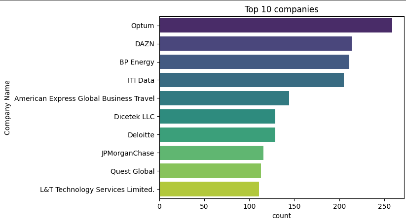
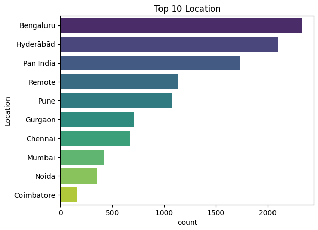
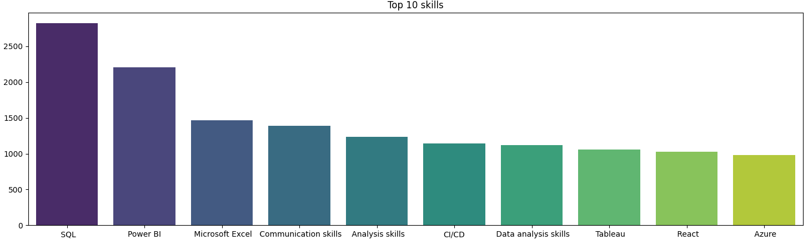
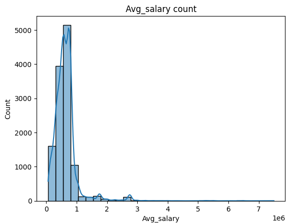
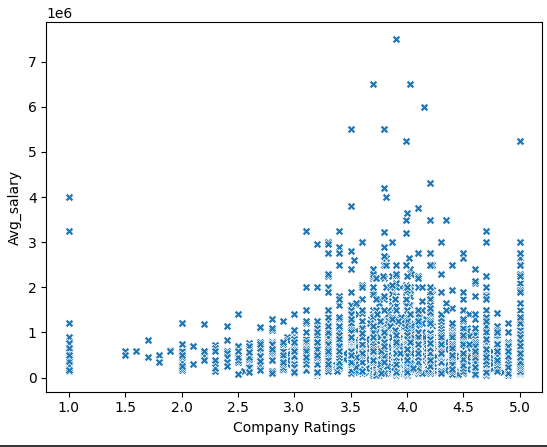
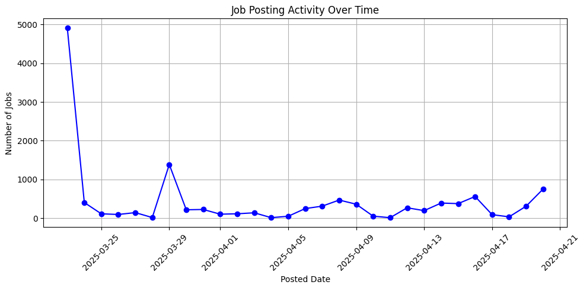
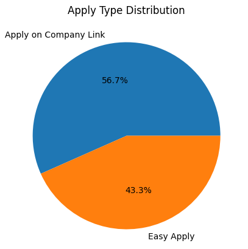

# 📊 Glassdoor Job Postings EDA - Market Insights Analysis


**A comprehensive Exploratory Data Analysis (EDA) project analyzing 12,000+ job postings from Glassdoor to decode hiring trends, salary benchmarks, and skill requirements in the Indian tech market.**

---

## 📖 Table of Contents
- [Problem Statement](#-problem-statement)
- [Project Objective](#-project-objective)
- [Dataset Overview](#-dataset-overview)
- [Key Insights](#-key-insights)
- [Technical Approach](#-technical-approach)
- [Technologies Used](#-technologies-used)
- [Installation & Usage](#-installation--usage)
- [Project Structure](#-project-structure)
- [Future Enhancements](#-future-enhancements)
- [License](#-license)

---

## ❓ Problem Statement
Navigating the modern job market is overwhelming. Students lack clarity on which skills are truly in demand, educational institutions often struggle to align curricula with industry needs, and job seekers frequently misjudge salary expectations for roles like "Data Analyst" or "Full Stack Developer." There is a disconnect between market reality and applicant expectations.

## 🎯 Project Objective
This project aims to bridge the information gap by transforming raw job posting data into actionable intelligence.
*   **For Students:** Identify high-demand skills (e.g., SQL, Power BI) to prioritize learning.
*   **For Institutions:** Update course content based on real-time industry data from companies like Optum and BP Energy.
*   **For Job Seekers:** Provide data-backed salary benchmarks based on location and experience.

---

## 📁 Dataset Overview
*   **Source:** Scraped from Glassdoor using Octoparse.
*   **Volume:** ~14,000 initial records, cleaned down to **12,000+** high-quality data points.
*   **Features:** Job Title, Company Name, Ratings, Location, Salary Estimates, Job Description, and Required Skills.

---

## 🔍 Key Insights

### 1. 🏢 Hiring Giants
*   Major recruiters include **Optum**, **DAZN**, and **BP Energy**.
*   *Insight:* Large MNCs dominate the hiring volume for entry-to-mid-level tech roles.



### 2. 📍 Tech Hub Dominance
*   **Bengaluru** and **Hyderabad** account for the vast majority of job postings.
*   *Insight:* Relocation to these hubs significantly increases job prospects for tech professionals.



### 3. 🛠️ Skill Combinations
*   **SQL + Power BI + Excel** is the "Holy Trinity" for Data Analyst roles.
*   *Insight:* Technical skills alone aren't enough; visualization and data manipulation are non-negotiable.



### 4. 💰 Salary Trends
*   The median salary range for tracked roles falls between **₹5L – ₹10L PA**.
*   Higher company ratings (>4.0) correlate positively with better compensation packages.




### 5. 📈 Additional Market Trends
*   **Job Posting Activity:**
    
*   **Application Methods:**
    

---

## 🏗️ Technical Approach

1.  **Data Collection:** Automated scraping to gather raw job listings.
2.  **Data Cleaning (Pandas):**
    *   Parsed complex Salary strings (e.g., "₹7L - ₹9L") into numeric `min_salary`, `max_salary`, and `avg_salary`.
    *   Cleaned unstructured 'Skills' text fields into standardized lists.
    *   Handled missing values in ratings and location data.
3.  **Exploratory Data Analysis:**
    *   Univariate Analysis on Job Titles and Locations.
    *   Bivariate Analysis connecting *Company Ratings* to *Salary*.
4.  **Visualization:** Creating intuitive bar charts, pie charts, and distribution plots using **Seaborn** and **Matplotlib**.

---

## 🛠️ Technologies Used

| Category | Technologies |
| :--- | :--- |
| **Language** | Python 3.11 |
| **Data Manipulation** | Pandas, NumPy |
| **Visualization** | Seaborn, Matplotlib |
| **Regular Expressions** | Python `re` module (for text parsing) |
| **Notebook Environment** | Jupyter Notebook |

---

## 💻 Installation & Usage

### Prerequisites
*   Python 3.8+
*   Jupyter Notebook or VS Code

### Steps

1.  **Clone the Repository**
    ```bash
    git clone https://github.com/raju20215/GlassdoorJobposting.git
    cd GlassdoorJobposting
    ```

2.  **Create a Virtual Environment**
    ```bash
    python -m venv venv
    # Windows
    venv\Scripts\activate
    # Mac/Linux
    source venv/bin/activate
    ```

3.  **Install Dependencies**
    ```bash
    pip install pandas numpy matplotlib seaborn
    ```

4.  **Run the Notebook**
    ```bash
    jupyter notebook datavisualization.ipynb
    ```

---

## 📂 Project Structure

```
GlassdoorJobposting/
├── datavisualization.ipynb # Main analysis notebook containing code & plots
├── finaldata2.csv          # Cleaned dataset used for analysis
├── images/                 # Exported visualizations (e.g., top_skills.png)
├── .gitignore              # Files to ignore in Git
├── README.md               # Project Documentation
└── LICENSE                 # MIT License
```

---

## 🚀 Future Enhancements
*   **NLP Analysis:** Implement specific keywords extraction from Job Descriptions to find "hidden" soft skills.
*   **Dashboarding:** Port the static analysis to a dynamic **Tableau** or **Power BI** dashboard.
*   **Predictive Modeling:** Build a salary prediction model based on the cleaned data.

---

## 📄 License
Distributed under the MIT License. See `LICENSE` for more information.

---

### 👤 Author
**Uppu Palakonda Raju**
*   [LinkedIn](https://www.linkedin.com/in/palakondaraju-uppu-raju20215/)
*   [GitHub](https://github.com/raju20215)
*   [Email](mailto:palakondarajuuppu@gmail.com)
